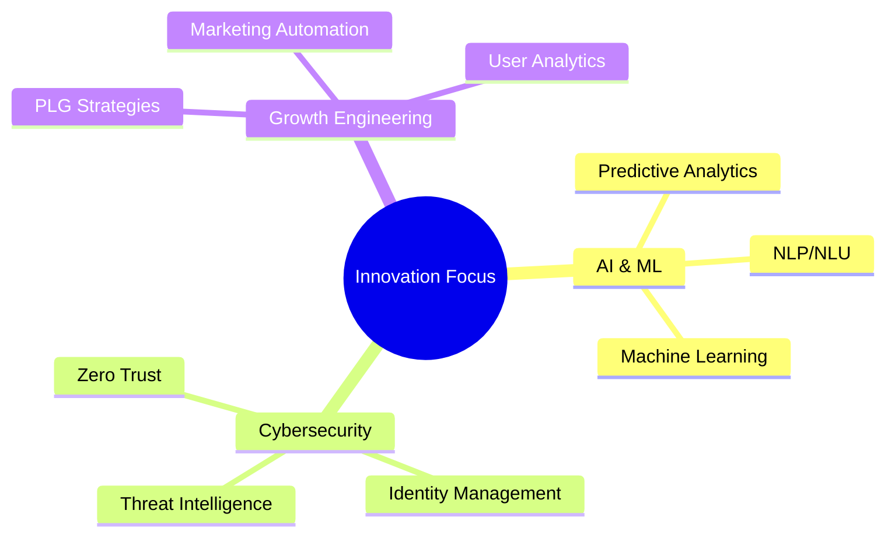

# 👋 Hello, I'm Deepak

## 🚀 Visionary Tech Entrepreneur | 🛡️ Cybersecurity Enthusiast | 🌱 Growth Hacker

> Serial entrepreneur transforming the landscape of AI and cybersecurity. Building the future of B2B tech innovation and democratizing AI access.

## 🌟 Featured Projects
- **[Cyber Pulse](https://github.com/grackerai/cyber-pulse)** - Your daily dose of cybersecurity insights and AI-powered threat intelligence

## 🚀 Current Ventures
- **Co-founder & CEO at [GrackerAI](https://gracker.ai)** - Revolutionizing B2B cybersecurity marketing with AI-powered solutions
- **Co-founder at [LogicBalls](https://logicballs.com)** - Democratizing AI technology access for everyone
- Previously founded **LoginRadius** - Scaled to $8M ARR through product-led growth, serving millions globally

## 💡 Areas of Expertise
- 🤖 AI Implementation & Innovation
- 🛡️ Enterprise Security Architecture
- 🚀 Product-Led Growth (PLG) Strategies
- 🔐 Digital Identity & Access Management
- 📈 B2B SaaS Development & Scaling
- 🎯 Go-to-Market Strategy

## 📚 Publications & Contributions
- Author of "Don't Ever Think About Passwords Again"
- Author of "Data Privacy - What Enterprises Need to Know?"
- Contributing author to "Handbook of Computer Networks and Cyber Security"
- Patent holder for DDoS defense system innovations

## 🎯 Current Focus
- Advancing AI applications in cybersecurity marketing
- Developing innovative solutions for B2B growth automation
- Creating accessible AI tools for businesses of all sizes
- Contributing to open-source security projects

## 🤝 Let's Connect
- 🌐 Blog: [guptadeepak.com](https://guptadeepak.com)
- 🐦 X: [@dip_ak](https://twitter.com/dip_ak)
- 💼 LinkedIn: [dpgupta](https://linkedin.com/in/dpgupta)
- 🌟 BlueSky: [@guptadeepak.com](https://bsky.app/profile/guptadeepak.com)

### 🚀 Technologies I'm Excited About

> "The future belongs to those who believe in the beauty of their dreams." - Eleanor Roosevelt

Let's build the future together! 🚀

---
