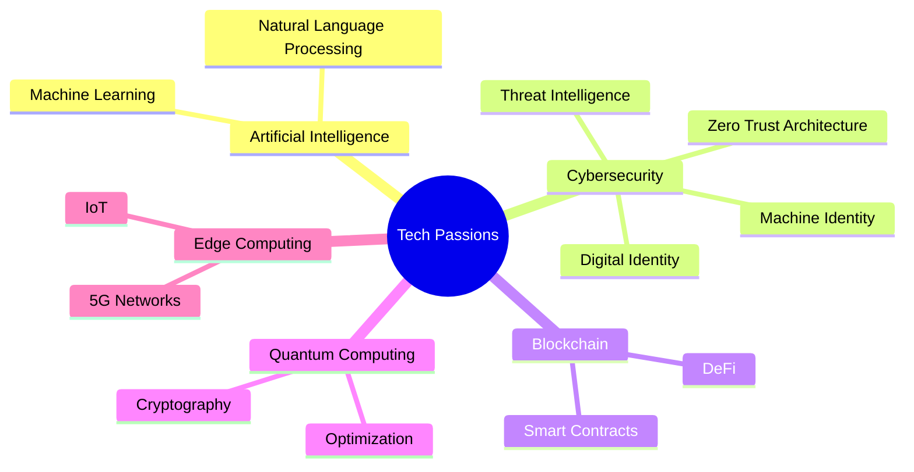

# 👋 Hello, I'm Deepak Gupta

## 🚀 Visionary Tech Entrepreneur | 🛡️ Cybersecurity Enthusiast | 🌱 Growth Hacker

Welcome to my digital playground! I'm on a mission to reshape the future through innovative tech solutions and groundbreaking ideas.

### 🛠️ Current Projects

- **[GrackerAI](https://gracker.ai)** - Revolutionizing Growth Hacking for B2B Cybersecurity and Infra companies
- **[LogicBalls AI](https://logicballs.com)** - AI for Everyone, Everywhere

### 🧠 My Tech Prophecies

1. **AI**: The rise of AI will create more creative and cool jobs than it eliminates.
2. **Crypto**: Cryptocurrency will become a major player in global finance, but not in its current form.
3. **Privacy**: The concept of privacy as we know it will be obsolete within a generation.
4. **Space**: Space travel will become a reality within the next couple of decades.

### 🌐 Let's Connect!

- 🐦 X: [@dip_ak](https://x.com/dip_ak)
- 💼 LinkedIn: [in/dpgupta](https://www.linkedin.com/in/dpgupta)
- 🌐 Website: [guptadeepak.com](https://guptadeepak.com)

### 🚀 Technologies I'm Excited About

---

> "The future belongs to those who believe in the beauty of their dreams." - Eleanor Roosevelt

Let's build the future together!
